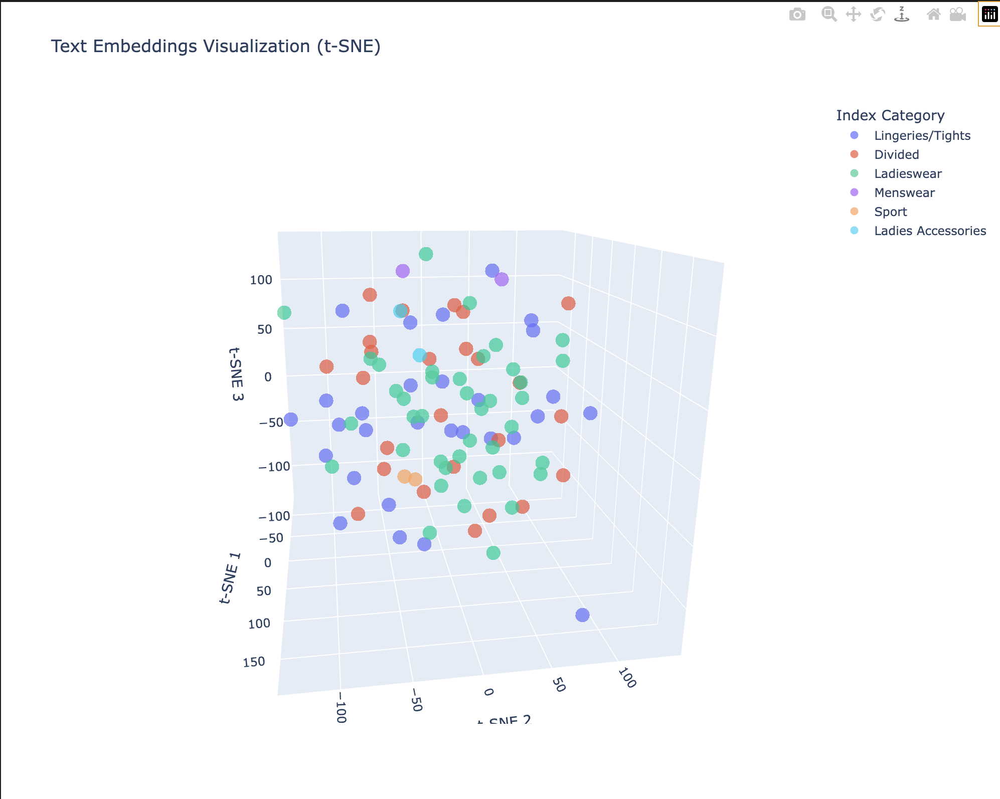
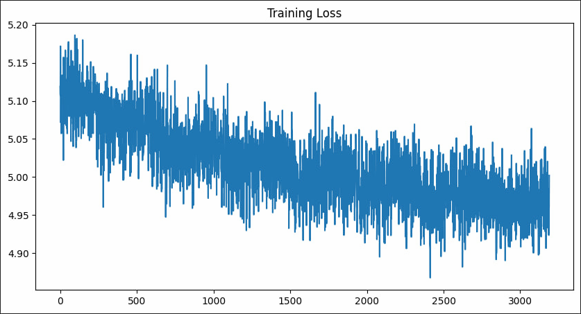
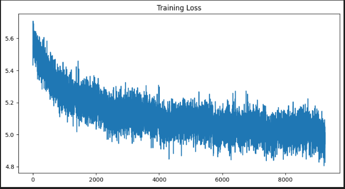

# Рекомендательная система на transformer decoder


Представить задачу рекомендаций как задачу предсказания ряда элементов, которые хотим рекомендовать. Сделать свой transformer decoder для решения [этой задачи]( https://www.kaggle.com/competitions/h-and-m-personalized-fashion-recommendations).

## Структура проекта


```
├── LICENSE            <- Лицензия с открытым исходным кодом, если она выбрана
├── Makefile           - Makefile с удобными командами, например, `make data` или `make train`
├── README.md          <- Главный README для разработчиков, использующих этот проект.
├── data
│   ├── external       <- Данные из сторонних источников.
│   ├── interim        <- Промежуточные данные, которые были преобразованы.
│   ├── processed      <- Финальные, каноничные наборы данных для моделирования.
│   └── raw            <- Оригинальные, неизменные данные.
│
├── docs               <- Стандартный проект mkdocs; см. www.mkdocs.org для подробностей
│
├── models             <- Обученные и сериализованные модели, предсказания моделей или резюме моделей
│
├── notebooks          <- Jupyter ноутбуки. Принцип именования: номер (для упорядочивания),
│                         инициалы создателя и краткое описание через дефис, например:
│                         `1.0-jqp-initial-data-exploration`.
│
├── pyproject.toml     <- Файл конфигурации проекта с метаданными пакета для 
│                         recsys и конфигурацией для инструментов, таких как black
│
├── references         <- Словари данных, руководства и все другие пояснительные материалы.
│
├── reports            <- Сгенерированные анализы в форматах HTML, PDF, LaTeX и т. д.
│   └── figures        <- Сгенерированные графики и фигуры, используемые в отчетах
│
├── requirements.txt   <- Файл зависимостей для воспроизведения среды анализа, например,
│                         сгенерированный с помощью `pip freeze > requirements.txt`
│
├── setup.cfg          <- Конфигурационный файл для flake8
│
└── recsys   <- Исходный код для использования в этом проекте.
    │
    ├── __init__.py             <- Делает recsys Python модулем
    │
    ├── config.py               <- Хранит полезные переменные и конфигурацию
    │
    ├── dataset.py              <- Скрипты для скачивания или генерации данных
    │
    ├── features.py             <- Код для создания признаков для моделирования
    │
    ├── modeling                
    │   ├── __init__.py 
    │   ├── predict.py          <- Код для выполнения предсказаний с обученными моделями
    │   └── train.py            <- Код для обучения моделей
    │
    └── plots.py                <- Код для создания визуализаций
```


--------
# Описание решения
--------
##  "Кластеризация" 
 Для отображения товаров с использованием t-SNE (t-Distributed Stochastic Neighbor Embedding) и позиционного кодирования, можно использовать следующий подход:


### Шаги реализации

1. **Определение модели с позиционным кодированием**:
   - Использование класса `PositionalEncoding` для добавления позиционного кодирования к эмбеддингам товаров.

2. **Получение эмбеддингов товаров**:
   - Пропускание описаний товаров через модель трансформера для получения эмбеддингов.

3. **Применение t-SNE**:
   - Применение t-SNE для снижения размерности эмбеддингов.

4. **Визуализация**:
   - Визуализация результатов t-SNE.

1. **Определение модели**:
   - Класс добавляет позиционное кодирование к эмбеддингам товаров.
```python
class PositionalEncoding(torch.nn.Module):

    def __init__(self,
            d_model: int,
            dropout: float = 0.1,
            max_len: int = 5000,
        ):
        super().__init__()
        self.dropout = torch.nn.Dropout(p=dropout)

        position = torch.arange(max_len).unsqueeze(1)
        div_term = torch.exp(
            torch.arange(0, d_model, 2) * (-math.log(10000.0) / d_model)
        )
        pe = torch.zeros(1, max_len, d_model)
        pe[0:, :, 0::2] = torch.sin(position * div_term)
        pe[0:, :, 1::2] = torch.cos(position * div_term)
        # позиционное кодирование
        self.register_buffer("pe", pe)

        self.d_model = d_model

    def forward(self, x: torch.Tensor) -> torch.Tensor:
        """
        Args:
            x: Tensor, shape [seq_len, batch_size, embedding_dim]
        """

        x = x + self.pe[:, : x.size(1)] / math.sqrt(self.d_model)

        return self.dropout(x)

class Model(LightningModule):

    def __init__(
        self,
        lr=0.001,
        use_pretrained=False,
        dropout=0.2,
        d_model=128,
        n_vocab=30_522,
        smoothing=0.1,
    ):
        super().__init__()
        self.dropout = dropout

        self.lr = lr
        self.d_model = d_model
        self.n_vocab = n_vocab
        self.smoothing = smoothing

        # Text embeddings and encoder
        self.item_embeddings = torch.nn.Embedding(self.n_vocab, self.d_model)
        self.pos_encoder = PositionalEncoding(
            d_model=self.d_model, dropout=self.dropout
        )
        encoder_layer = torch.nn.TransformerEncoderLayer(
            d_model=self.d_model, nhead=4, dropout=self.dropout, batch_first=True
        )
        self.encoder = torch.nn.TransformerEncoder(encoder_layer, num_layers=4)

        # Output layer to project to vocabulary size
        self.output_layer = torch.nn.Linear(self.d_model, self.n_vocab)

        self.save_hyperparameters()


    def encode_text(self, x):
        x = self.item_embeddings(x)
        x = self.pos_encoder(x)
        x = self.encoder(x)
        x = self.output_layer(x)  # Add projection to vocab size

        return x  # Return full sequence output for language modeling

    def forward(self, x):
        x = self.item_embeddings(x)
        x = self.pos_encoder(x)
        x = self.encoder(x)
        x = self.output_layer(x)  # Project to vocab size
        return x
```


2. **Предобработка данных**:
Как таковой ее нет, просто объеденяем все текстовые поля для добавления контекста:
```python
df = pd.read_csv(
    config.PROCESSED_DATA_DIR / "articles.csv",
    nrows=None,
    dtype={
        "article_id": str,
    },
)

df["text"] = df.apply(
    lambda x: " ".join(
        [
            str(x["prod_name"]),
            str(x["product_type_name"]),
            str(x["product_group_name"]),
            str(x["graphical_appearance_name"]),
            str(x["colour_group_name"]),
            str(x["perceived_colour_value_name"]),
            str(x["index_name"]),
            str(x["section_name"]),
            str(x["detail_desc"]),
        ]
    ),
    axis=1,
)
```
5. **Обучение**
	После 100 эпох получили удовлетворительный loss для валидации и очень варьирующий на валидации. В качестве loss использовали кросс энтропию что посчитали удовлетворительным для класстеризации об этом далее:
	```
	Epoch 100/100, Train Loss: 0.2713, Val Loss: 0.5675
	```
6. **Применение t-SNE**:
   - Применяем t-SNE для снижения размерности эмбеддингов до 2D.
   и в качестве примера посмотрим 100 закодированных наименований:
   


## Получение эмбедингов

Модель энкодер - bert-base-cased  
У каждого товара брался текст с колонок 
[   prod_name, 
    product_type_name, 
    product_group_name, 
    graphical_appearance_name, 
    colour_group_name, 
    perceived_colour_value_name, 
    index_name, 
    section_name, 
    detail_desc
] и по этим данным строился эмбеддинг.  
Также были закодированы системные токены `<pad>` `<sos>` и `<eos>`


## Модель Decoder Obly Transformer

В первом случае, для обучения только на id товаров была выбрана такая архитектура модели:
```
Transformer(
  (embedding): Embedding(1003, 256)
  (pos_emb): SinusoidalPosEmb()
  (blocks): ModuleList(
    (0-7): 8 x TransformerBlock(
      (norm1): LayerNorm((256,), eps=1e-05, elementwise_affine=True)
      (multihead_attn): MultiheadAttention(
        (out_proj): NonDynamicallyQuantizableLinear(in_features=256, out_features=256, bias=True)
      )
      (norm2): LayerNorm((256,), eps=1e-05, elementwise_affine=True)
      (mlp): Sequential(
        (0): Linear(in_features=256, out_features=1024, bias=True)
        (1): ELU(alpha=1.0)
        (2): Linear(in_features=1024, out_features=256, bias=True)
      )
    )
  )
  (fc_out): Linear(in_features=256, out_features=1003, bias=True)
)
```

Во втором случае с использованием эмбеддингов BERT архитектура выглядит так:
```
Transformer(
  (pos_emb): SinusoidalPosEmb()
  (blocks): ModuleList(
    (0-7): 8 x TransformerBlock(
      (norm1): LayerNorm((768,), eps=1e-05, elementwise_affine=True)
      (multihead_attn): MultiheadAttention(
        (out_proj): NonDynamicallyQuantizableLinear(in_features=768, out_features=768, bias=True)
      )
      (norm2): LayerNorm((768,), eps=1e-05, elementwise_affine=True)
      (mlp): Sequential(
        (0): Linear(in_features=768, out_features=3072, bias=True)
        (1): ELU(alpha=1.0)
        (2): Linear(in_features=3072, out_features=768, bias=True)
      )
    )
  )
  (fc_out): Linear(in_features=768, out_features=1003, bias=True)
) 
```
# Обучение 
Первый вариант 100 эпох:


Второй вариант 60 эпох:


# Результаты генерации


# Установка
Для запуска проекта необходимо выполнить следующие шаги:
1. Клонировать репозиторий:
```bash
git clone https://github.com/larek-tech/transformer-recsys.git
```
2. Установить зависимости:
```bash
poetry install
```
## Запуск модулей
1. Предобработка датасета:
### Для обучения рекомендательной модели
```bash
poetry run python -m recsys.dataset main --split 
```
### Для кластеризации
```bash
poetry run python -m recsys.dataset embeddings
```
## Обучение рекомендательной модели
```bash
poetry run python -m recsys.modeling.train 
```